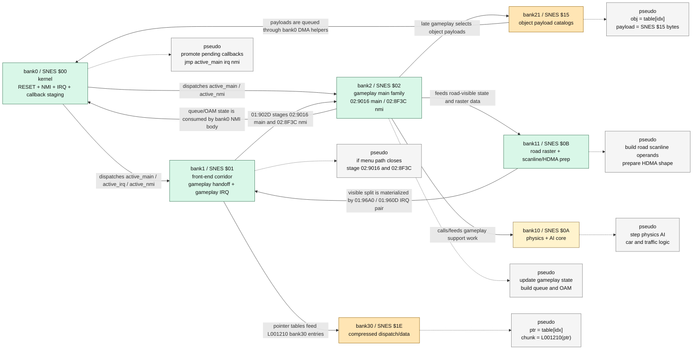

# SNES Bank Flow Datagram

This root-level note is intentionally narrow: it only shows the current
promoted flow between ROM banks in the original SNES codebase we are
disassembling.

## Current Promoted Bank Flow

## Reading Notes

- `bank0` is the control kernel. It owns the callback slots/staging cells and
  wraps the actual `NMI` and `IRQ` dispatch.
- `bank1` is the strongest validated bridge bank:
  it closes the front-end path and explicitly stages the gameplay family at
  `01:902D`, while also owning the validated gameplay IRQ pair
  `01:96A0 / 01:960D`.
- `bank2` is the current promoted gameplay bank:
  main callback `02:9016`, NMI callback `02:8F3C`.
- `bank10` and `bank11` are gameplay-support banks, not top-level schedulers.
- the currently promoted object-catalog bank is SNES `$15`
  (repo file `bank21.asm`), not repo file `bank15.asm`
- `bank21/$15` and `bank30/$1E` are content/support banks whose consumers are
  known, but whose full provenance map is still being closed
