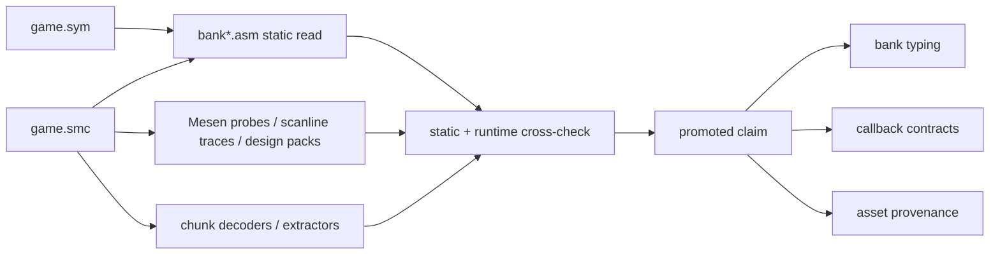
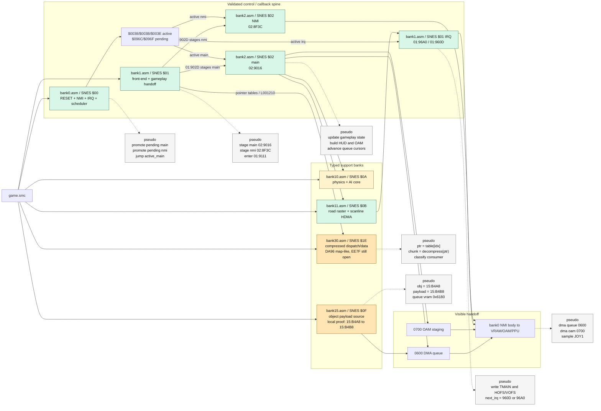

# Bank Investigation Datagram

This root-level note is a high-level map of how the repo currently investigates
ROM banks and which bank roles/callback links are already promoted.

## Investigation Loop

## Current Validated Spine

## Reading Notes

- `bank0` is the control kernel. It owns RESET, the NMI wrapper/body, the IRQ
  wrapper, and callback staging/promotion.
- `bank1` is the validated handoff bank for the front-end to gameplay
  corridor. `01:902D` explicitly stages `02:9016` and `02:8F3C`.
- `bank2` is the promoted gameplay callback family currently seen as main
  `02:9016` and NMI `02:8F3C`.
- `bank1` also owns the validated gameplay IRQ pair `01:96A0 / 01:960D`.
- `bank10` and `bank11` are the active gameplay-support banks for physics/AI
  and road/split raster work.
- `bank15` and `bank30` are typed as content/support banks, but their role is
  still consumer/provenance-driven rather than fully closed as one-line
  labels.
